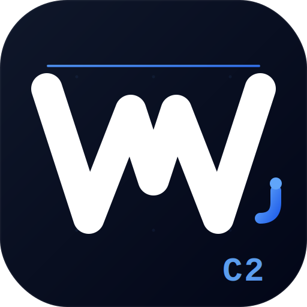

<div align="center">



# WebClip C2

<p><i>iOS red-team implant platform - delivered as a managed WebClip</i></p>

[](https://python.org)
[](https://fastapi.tiangolo.com)
[](https://react.dev)
[](https://apple.com)
[](LICENSE)

[What Is This](#-what-is-this) · [Features](#-features) · [Architecture](#-architecture) · [Setup](#-setup) · [Dashboard](#-dashboard) · [Security](#-security)

</div>

<br/>

> **No MDM enrollment. No App Store. No jailbreak.**
> One `.mobileconfig` file turns a Safari download into a persistent iOS C2 implant.
> The target sees a home-screen icon. You see a real-time operator console.

<br/>

## 📖 What Is This?

Apple allows any website to install a **WebClip** - a shortcut that places a web app directly on the iPhone home screen - via a `.mobileconfig` profile. Enterprises use this legitimately to deploy internal portals without the App Store.

**WebClip C2 weaponizes this mechanism for authorized red-team engagements:**

**① Delivery** - Send a `.mobileconfig` to the target (email, AirDrop, QR phishing page). The target taps *Allow* in Safari. No special permissions. No enrollment. Under 10 seconds.

**② Implant** - The WebClip opens a Progressive Web App with `FullScreen: true`. No address bar. No browser chrome. No TLS indicator. To the target, it looks and feels like a native app.

**③ Persistence** - A Service Worker caches the entire app offline. The implant survives reboots, background kills, airplane mode, and network changes - and reconnects automatically.

**④ Collection** - Standard Web APIs reach sensors, the clipboard, the camera, and network interfaces - many with zero user prompts. Data streams to the operator in real time.

**⑤ Console** - A React dashboard provides a full C2 interface: command queue, live results, harvest manager, kill-chain builder, and a persona studio for crafting convincing WebClips.

> **Why does this matter?** WebClips bypass App Store review, are invisible to most MDM policies, and require exactly one tap from the target - with no elevated privileges. The attack surface exists on every iPhone and iPad running iOS 14+, managed or unmanaged.

<br/>

## ⚡ Features

### Implant (iOS PWA)
- **Zero-prompt fingerprint** - UA, screen, battery, network type, timezone, language, canvas hash - silent, no dialogs
- **Persistent Service Worker** - survives background kill, reboot, airplane mode; auto-reconnects
- **Real-time C2 channel** - bidirectional WebSocket with exponential backoff
- **JS remote execution** - arbitrary eval with live result streaming back to operator
- **Web Push (VAPID)** - push notifications survive app close on iOS 16.4+

### Harvest Modules
- **PIN harvest** - pixel-perfect iOS passcode overlay, 6-digit capture, success animation, configurable attempt limit
- **Credential phishing** - cloned login pages injected as fullscreen overlay; captured and streamed
- **OTP relay** - second-factor interception with configurable timeout

### Recon Modules
- **Geolocation** - GPS coordinates via `navigator.geolocation`
- **LAN scanner** - network topology via timing probes, zero permissions required
- **DNS rebind** - reaches `192.168.x.x` admin panels from browser context (FortiGate, routers, NAS)
- **Camera / microphone** - live preview and VU meter via `getUserMedia`
- **Motion sensors** - accelerometer / gyroscope stream

### Operator Platform
- **React dashboard** - real-time fleet overview, per-device C2 console, harvest manager
- **Kill chain builder** - multi-step attack flows with per-device execution state
- **WebClip Studio** - persona + onboarding builder
- **Web Push center** - broadcast or targeted push to enrolled devices
- **Opsec panel** - log scrub, session hygiene, engagement status

<br/>

## 🏗 Architecture

| Layer | Tech | Purpose |
|-------|------|---------|
| **Implant** | Vanilla JS + Service Worker | iOS PWA cached offline, C2 client |
| **Collection API** | FastAPI · port 18443 | Device-facing: beacon, commands, data upload |
| **Dashboard API** | FastAPI · port 18080 | Operator-facing: JWT-gated, firewall-restricted |
| **Operator UI** | React 18 + Vite | Real-time dashboard, pre-built and shipped |
| **Database** | SQLite + SQLAlchemy | Devices, events, credentials, commands |
| **Auth** | JWT (HS256) + bcrypt | Role-based: admin / operator / viewer |
| **Push** | VAPID + Web Push | Works when app is backgrounded (iOS 16.4+) |
| **Edge** | Cloudflare + nginx | TLS termination, WebSocket upgrade |

<details>
<summary><b>Project structure</b></summary>

```
webclip-c2/
├── webclip/                    iOS PWA implant
│   ├── sw.js                   Service Worker (offline cache + C2 pump)
│   ├── index.html
│   └── app/
│       ├── main.js             Bootstrap, WS client, reconnect
│       ├── beacon.js           Fingerprint + heartbeat
│       ├── commands.js         Command dispatcher
│       └── modules/            40+ capability modules
│           ├── pin_harvest.js
│           ├── harvest.js
│           ├── geo.js
│           ├── network.js
│           ├── rebind.js
│           └── ...
├── backend/                    FastAPI backend
│   ├── main.py                 Two-app factory (collection + dashboard)
│   ├── models.py               SQLAlchemy ORM models
│   ├── auth.py                 JWT + bcrypt + role guards
│   └── api/
│       ├── collection.py       /api/* device endpoints
│       └── dashboard/          /api/* operator endpoints
├── frontend/                   React operator dashboard (Vite)
│   └── src/pages/
│       ├── DeviceDetail.jsx    Full C2 console
│       ├── HarvestManager.jsx  Credential + PIN management
│       ├── KillChain.jsx       Attack flow builder
│       └── ...
├── frontend-dist/              Pre-built dashboard
└── scripts/
    ├── gen-mobileconfig.py     Generate target .mobileconfig
    └── start.sh                One-shot launcher
```
</details>

<br/>

## 🚀 Setup

**Requirements:** Python 3.11+ · Node.js 18+ *(build only)* · Valid TLS certificate

### Clone

```bash
git clone https://github.com/danieloz147/webclip-c2.git && cd webclip-c2
```

### Backend

```bash
python3 -m venv .venv && source .venv/bin/activate
pip install -r backend/requirements.txt
```

### Configure

```bash
cp backend/.env.example .env
```

```env
SECRET_KEY=<python3 -c "import secrets; print(secrets.token_hex(32))">
SERVER_BASE_URL=https://your-collection-domain.com
VAPID_PRIVATE_KEY=...
VAPID_PUBLIC_KEY=...
```

> The server **refuses to start** if `SECRET_KEY` is missing or set to the default value.

<details>
<summary><b>Generate VAPID keys</b></summary>

```bash
python3 - <<'EOF'
from py_vapid import Vapid01
v = Vapid01()
v.generate_keys()
print("VAPID_PRIVATE_KEY =", v.private_key.private_bytes_raw().hex())
print("VAPID_PUBLIC_KEY  =", v.public_key.public_bytes_raw().hex())
EOF
```
</details>

### Initialize

```bash
python3 -m backend.seed
# Creates DB + first admin account: admin / changeme - rotate immediately
```

### SF Pro Fonts *(PIN harvest fidelity)*

Download from [developer.apple.com/fonts](https://developer.apple.com/fonts/) and place in `webclip/`:
`SF-Pro-Display-Regular.otf` · `SF-Pro-Display-Light.otf` · `SF-Pro-Text-Regular.otf` · `SF-Pro-Text-Medium.otf`

### nginx

<details>
<summary><b>nginx config</b></summary>

```nginx
server {
    listen 443 ssl http2;
    server_name YOUR_DOMAIN;
    ssl_certificate /path/to/cert.pem;
    ssl_certificate_key /path/to/key.pem;

    location / {
        proxy_pass http://127.0.0.1:18443;
        proxy_http_version 1.1;
        proxy_set_header Upgrade $http_upgrade;
        proxy_set_header Connection "upgrade";
    }
}

server {
    listen 8443 ssl http2;
    server_name YOUR_DOMAIN;
    ssl_certificate /path/to/cert.pem;
    ssl_certificate_key /path/to/key.pem;

    location / {
        allow YOUR_OPERATOR_IP;
        deny  all;
        proxy_pass http://127.0.0.1:18080;
    }
}
```
</details>

### Launch

```bash
python3 -m backend.main
# ◉ Collection → :18443  |  ◉ Dashboard → :18080
```

### Deploy Implant

```bash
python3 scripts/gen-mobileconfig.py \
  --domain your-domain.com --label "Company Portal" \
  --icon assets/icon.png --output portal.mobileconfig
```

Target taps **Allow** → icon on home screen → beacon fires in **< 3 seconds**.

<br/>

## 🖥 Dashboard

| Page | Description |
|------|-------------|
| **Devices** | Fleet overview - model, OS, last-seen, engagement score |
| **Device Detail** | Full C2 console - command queue, live results, module launcher |
| **Fleet View** | Real-time beacon grid + map |
| **Harvest Manager** | Templates + captured PINs / credentials, per-entry delete |
| **Kill Chain** | Multi-step attack flow builder, per-device state |
| **LAN Map** | Network topology discovered from each device |
| **Opsec Panel** | Log scrub, session hygiene |
| **Settings** | VAPID, operator accounts, webhooks |

<br/>

## 🔐 Security

Pre-release security review applied the following fixes: JWT type validation (refresh tokens rejected as access tokens), SSRF guard on harvest validation URLs, `ws-token` endpoint restricted to localhost, `secure=True` session cookie, role-gated credential deletion, fail-fast startup on default `SECRET_KEY`.

<details>
<summary><b>Deployment checklist</b></summary>

- [ ] `SECRET_KEY` set in `.env` - server hard-fails without it
- [ ] Default admin password rotated on first login
- [ ] Dashboard port (18080) firewalled to operator IP only
- [ ] `data/webclip.db` wiped at engagement close
- [ ] Opsec panel log scrub run before handoff
</details>

<br/>

## ⚖️ Legal

For use on systems you own or have **explicit written permission** to test. Unauthorized deployment is illegal. Authors assume no liability.

<br/>

<div align="center">
<sub>Built for red teams · Deployed with intent · Cleaned up after</sub>
</div>
